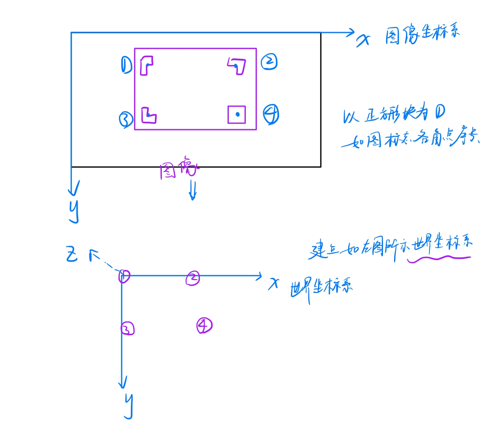

# CornerPointDetection
YanjieZe(the Last Refugee)

# 目录

[Ⅰ Use method](https://github.com/YanjieZe/visionLocalization#%E2%85%B0-use-method)

[Ⅱ Process Log](https://github.com/YanjieZe/visionLocalization#%E2%85%B1-process-log)

[Ⅲ Bug log](https://github.com/YanjieZe/visionLocalization#%E2%85%B2-bug-log)

# Ⅰ Use method

## 1 use mindvision cam for detection
> py detect.py --weights best.pt  --source 0 --view-img

## 2 Collect frame as the raw dataset, using mindvision camera
> py grabFrame.py --collection 1 --reponum (the numbe your want) --framenum (the number you want)
example:
> py grabFrame.py --collection 1 --reponum 4 --framenum 100

## 3 Use mindVision camera,just for a look
> python grabFrame.py --collection 0

## 4 use mindVison camera for detection
this python file is in another folder.So you should first:
> cd cornerfinding
then:
> python cornerfinding.py --mode camera

# Ⅱ Process Log

## **2020.11.13** start to write the code structure and detection algorithm

初步使用电脑自带的webcam进行检测。

## **2020.12.13** finish training YOLOV5 model

使用自己标定的数据集

## **2020.12.17** finish the collection module(grabFrame.py):

**connect the mindvision camera and auto collect frame as the raw dataset**

## **2021.01.09** start to modify the code but then decide to write **corner detection** first
开始自己尝试写角点检测算法。第一个想法是先把他切割出来，就是用yolo分割的结果做一个切割。简单的**getCropped()**实现一下。
第二个想法是用这个tag最明显的位置来进行角点的推算，有两个很容易检测的位置：中间的字母，右下角的一个小方块。那么我就先把轮廓提取出来，再把这两个的轮廓拿出来，求一下中心点的位置，就可以得到描述这个tag的两个特征。先把这个想法实现一下吧。得到这两个中心点的坐标后tag的四个角点坐标基本就出来了。

把轮廓面积排了一下，莫名和预计中的不一样。但是可以确定的是，可以用面积筛选方法得到中间字符的位置，不过要得到右下角小方块的位置用面积筛选的方法不怎么具有鲁棒性，因此找小方块另寻方法。

第三个想法：小方块是方形的，可以用一种匹配形状的方法把他找到吗？这个想法让我使用检测形状的方法来找出小方块，即轮廓逼近法。写了一下，效果还可以，不过结果竟然有两个，其中一个很奇怪，是边缘的一个角点，应该是有一个很小的矩形轮廓，应该是误判了。

因此第四个想法，再进一步优化一下，将轮廓逼近法之后再用面积比较法筛选一下试一试。

## **2021.01.10** continuing modifying
昨天的第四个想法实现之后，开始用mind vision camera进行实时检测。
发现在实时检测之中，有可能出现找不到矩形框的情况。做了一些优化。
目前尚存在的问题：可能会检测出很小的轮廓。
考虑在面积筛选的时候做一些优化。

做完优化后，可以找到点，但是会有很多点在飘，接下来考虑要么使用目标跟踪的算法，要么重新优化原来的算法。
在新的图片中我发现tag的红色十分明显，考虑从这一步入手先试一试。原先的**findCorner**可以先不改，对于轮廓提取做出改进就行。
第五个想法，颜色分割+轮廓识别重调。

颜色分割的结果意外地好。开始进行轮廓的识别和位置的计算。

面积筛选和中心点计算已完成，效果很好！详情见**redContourExtract**

接下来就是增强鲁棒性。
1. 原图高曝光，红色更容易识别，但是在不同场景下会失效。考虑如何提高这一方面的颜色适应性。
2. 算法中的颜色区域可能不够精准，考虑通过实时返回的hsv值对要识别的区域进行标定。

第六个想法，通过实时获得hsv值对想要得到的区域进行标定，再进行检测，即部分自动参数设置功能。

写好了一个取参数的函数**autoHSVget**。

使用**auotoHSVget**进行了参数调节，获得了正常曝光度情况下的结果，还不错！

## **2021.01.11** continuing modifying

为提高精度，开始尝试用apriltag算法。

附上一个靠谱的链接：[apriltag算法讲解](https://blog.csdn.net/han784851198/article/details/90261197?ops_request_misc=%25257B%252522request%25255Fid%252522%25253A%252522161033232116780258054111%252522%25252C%252522scm%252522%25253A%25252220140713.130102334.pc%25255Fall.%252522%25257D&request_id=161033232116780258054111&biz_id=0&utm_medium=distribute.pc_search_result.none-task-blog-2~all~first_rank_v2~rank_v29-1-90261197.pc_search_result_cache&utm_term=apriltag)

一个上午在看apriltag的算法和实现代码。首先直接使用了一下代码，发现效果不好，然后想了一下具体问题在于：这个算法用了凸包算法，但是我要检测的tag上只有一个算是凸包，还有三个是凹陷的。因此这个算法用来检测二维码还不错，检测这种奇怪的凹下去的形状就不太行了。

因此，在尝试了一上午后，还是决定用自己昨天写的算法，再借鉴apriltag算法中的一些东西做一下优化。

RedContourExtract算法优化进行中。

出现的问题：轮廓重识别。解决方法：在计算中心点时进行判断，若有两个轮廓的中心点相邻很近，排除。但是直接通过优化面积的算法解决了。

优化以后，效果：**fps=34.5**

添加了一个新的超参数：minArea，对于筛选面积时是十分重要的。

出现的问题：对于远距离识别，minArea要小，不然就找不到轮廓。对于近距离识别，minArea要大，不然就轮廓太多，会有噪声。

## **2021.01.12** start writing **PnP**

优化暂时到此为止，这几天的主要任务是写PnP算法，求解相机位置。

很久没有碰过PnP了。上午看了一下知乎和博客，回顾了**对极几何**和**PnP**。

附上一个还不错的讲解：[视觉SLAM:搞定坐标系、三角测量、PnP](https://zhuanlan.zhihu.com/p/80921759)

下午写一下算法进行实战。

首先对目前使用的mindvision相机进行标定，为方便，就用matlab了。

内参矩阵：

1557.90406532275	0	0
0	1543.49983613257	0
680.204169094410	644.295104426977	1

径向畸变：

-0.152787687060218	0.275768296110960

切向畸变：

0	0

具体数据保存在**camParams.mat**里

可以用P3P算法解这个问题，即提供三个点的像素坐标和空间坐标。

目前我的算法能勉强检测出三个坐标，过会再调调参数，优化一下，现在先写好用P3P算法解决问题。

出现问题：三个点或四个点的世界坐标要进行测量。

我自己先这样建世界坐标系了，把右下角的角点作为原点。

大概测量一下，记录测量结果：

右下角方块角点：（0，0，0）

右上角：（16，0，0）

左下角：（0，21，0）

左上角：（16，21，0）

**这个没有精确测量，暂时先看一下算法能不能用。**

出现问题：在实际应用中，返回的角点除了右下角方块角点可以确定对应面积最大的轮廓中心点，其他的点并不能确定。

**所以需要算法进行判定这四个点的相对位置！**

暂时还是得用四个点解PnP问题。

在用solvePnP求得旋转矩阵和平移矩阵后，再计算相机位置。

出现问题：solvePnP函数报错。

## 2021.01.13 continuing fixing bugs and pushing forward

首先把昨天solvePnP的bug修好了：**输入的世界坐标点和图像坐标点必须是float类型**

然后用暂时可以求解出位置了。

下一步要做的：写一个相对位置判断算法。

算法思路：四个点的相对位置是一定的，根据xy坐标进行判断。

这个算法是在我所建立的坐标系基础之上。坐标系如下：

**经过一番调试和改进后，目前已经可以解PnP问题并实时回馈！**

存在的问题：角点提取算法不够准确；相机标定不够准确；世界坐标系的点和图像坐标系的点不够准确。

因此精度还不够。开始考虑优化原来的角点算法，用apriltag里的思路。

**Apriltag 定位算法的主要步骤如下：**

1. 自适应阈值分割

2. 查找轮廓，使用 Union-find 查找连通域

3. 对轮廓进行直线拟合，查找候选的凸四边形

4. 对四边形进行解码，识别 Tag

5. 坐标变换，转换到世界坐标系

   

使用自适应阈值分割和查找连通域的方法试了一下，效果真的不怎么样。

还是考虑我原来的算法吧。=_=

调试了很久，在redContourExtract算法的**第一步mask合成时加一个新的mask，扩大部分阈值范围。**

效果变得很好。

**v3.0初步完成。**

实现效果：较为鲁棒地获得角点位置，并且返回相机位置。

还需要：将相机内参和世界坐标标定精确。

为增加鲁棒性，试着增加一个形状识别和相对位置筛选。

尝试用测试形状的方法去做，效果不好。

暂时没有新的优化思路了。

可以试一试用yolo做切割？

改写yolo：

尝试1：将dataset.py的loadstream对象修改

尝试成功，但是有一些问题。还是考虑从detect函数里改。

## 2021.01.14 reconstructing YOLOV5 and modifying

把yolov5的代码做了一些修改，放进了自己的函数。

# Ⅲ Bug log

## 1."bort" (this may appear on MacOS)
solution: 

> sudo code .